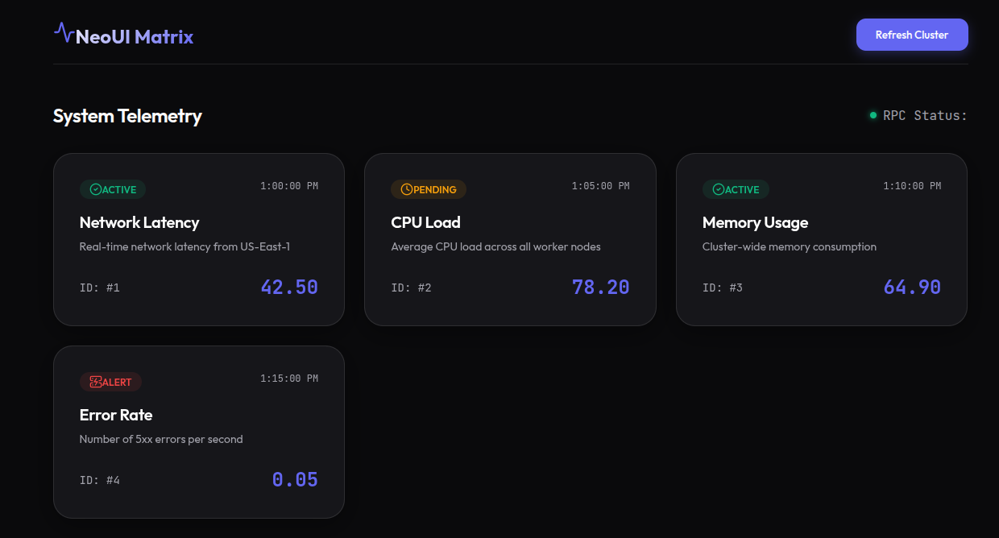

# Neo UI

NeoUI Matrix is a full-stack web application demonstrating a modern, highly efficient client-server architecture using **Rust**, **TypeScript**, **React**, and **ConnectRPC**.

## Architecture Overview

This project bypasses traditional REST/JSON bottlenecks in favor of a strictly typed, high-performance structured architecture:

*   **Common Data Layer:** Google Protobuf
*   **Backend:** Rust (Axum + ConnectRPC)
*   **Frontend:** TypeScript (React + Vite + ConnectRPC)
*   **Communication Protocol:** ConnectRPC (HTTP/1.1 or HTTP/2)

### Flow
1.  **Protobuf Definition**: The single source of truth (`proto/api/v1/data.proto`) dictates exactly what messages and RPC methods exist.
2.  **Code Generation**:
    *   **Server**: Generates Rust structs and the `SampleService` trait via `prost` & `connectrpc-build`.
    *   **Client**: Generates highly-optimized TypeScript primitives and a Promise-based client via `@bufbuild/protoc-gen-es` & `@connectrpc/protoc-gen-connect-es`.
3.  **Communication**: The React client uses `createConnectTransport` to ping the backend (`http://localhost:8080` proxied via Vite). The payloads are serialized into efficient binary messages natively, giving robust performance and minimal overhead.

---

## The Common Data Layer (Protobuf)
Protobuf is the contract that bridges the Rust server and the React client. Because both sides generate code from exactly the same `.proto` file, API breakages are caught at compile-time instead of runtime.

**`proto/api/v1/data.proto`:**
```protobuf
syntax = "proto3";
package api.v1;

service SampleService {
  rpc GetData(GetDataRequest) returns (GetDataResponse);
}

message GetDataRequest {
  string query = 1;
}

message GetDataResponse {
  repeated DataItem items = 1;
  string status = 2;
}

message DataItem {
  string id = 1;
  string title = 2;
  string description = 3;
  string timestamp = 4;
  double value = 5;
  Status type = 6;
}

enum Status {
  STATUS_UNSPECIFIED = 0;
  STATUS_ACTIVE = 1;
  STATUS_PENDING = 2;
  STATUS_ERROR = 3;
}
```

---

## How to Run

You will need two separate terminal sessions to run both ends of the stack.

### 1. Start the Rust Backend
The server is built using the Axum framework and serves the ConnectRPC service directly without wrapping a secondary server framework.

```bash
cd server
cargo run
```
> The server will start on `http://localhost:8080`.

### 2. Start the React Frontend
The frontend uses Vite as a development server and creates a proxy to seamlessly route `/api.v1.SampleService` calls to the Rust backend to avoid CORS complications.

```bash
cd client
npm install
npm run generate  # Only needed if you modify data.proto
npm run dev
```
> The Vite client development server will start on `http://localhost:5173`. Open this URL in your browser to view the UI.

The UI will automatically poll the Rust backend every 5 seconds, displaying dynamically rendered telemetry data using modern glassmorphism styling.


